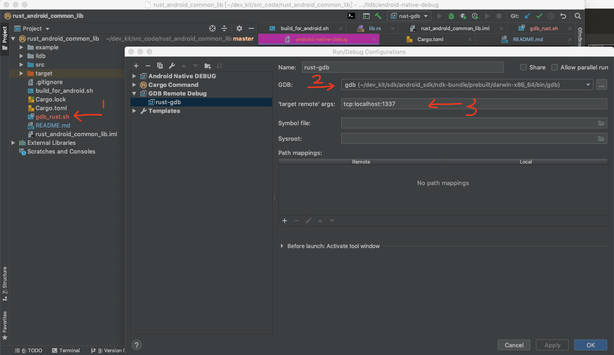

## Build & Run


- Way 1 :

```bash
cd rust_android_common_lib/example/android

# for real device that arm8
./gradlew installArm8Debug

# for real device that arm7
./gradlew installArm7Debug

# for android
./gradlew installX86_64Debug

```


- Way 2 :

By Android studio 3.4


## Detail

Just custom some gradle task to build the share-lib wrotten by `Rust-Lang` and make it's building easy.

https://github.com/Guang1234567/rust_android_common_lib/blob/2b13535653ee966446c618e26e1181334c20ad88/example/android/app/build.gradle#L91-L134


## How to set the Breaking Point for debuging rust code on android virtul device?


### Step 1:

```bash

./gdb_rust.sh ${android_app_id} ${pid}

# example
./gdb_rust.sh com.rust.example.android.debug 1234

```


### Step 2:

Clion remote debug cfg:




